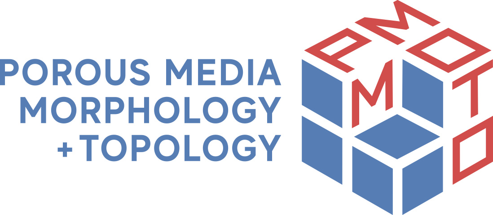

.. PMMoTo documentation master file, created by
   sphinx-quickstart on Sat May 31 13:45:49 2025.
   You can adapt this file completely to your liking, but it should at least
   contain the root `toctree` directive.

PMMoTo
====================

The Porous Media Morphology and Topology (PMMoTo) toolkit is an open-source Python library for analyzing, modeling, and characterizing the structure of porous materials. The code quantifies porous structures with a focus on distributed memory systems and MPI. It includes connected components analysis, morphological operations (e.g., addition and subtraction), and Euclidean distance transforms. Output images are intended for visualization in ParaView. PMMoTo also provides critical preprocessing and analysis tools for molecular dynamics simulations of porous materials.

.. toctree::
   :maxdepth: 2
   :caption: User Guide

   user_guide/installation
   user_guide/quickstart

.. toctree::
   :maxdepth: 1
   :caption: Examples

   examples/drainage_inkbottle
   examples/sphere_pack_psd
   examples/connected_pathways
   examples/md_porous_media

.. toctree::
   :maxdepth: 1
   :caption: API Reference

   api/modules
